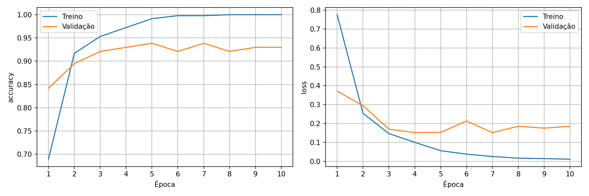

# Aula 6 — Transfer Learning com MobileNetV2

Esta atividade treina um classificador de imagens com MobileNetV2 e registra a
execução exigida no Google Colab. O notebook completo, com as saídas preservadas,
está em
[`notebooks/aula6/notebook_mobilenet_transfer_learning_aula6_executado.ipynb`](../../notebooks/aula6/notebook_mobilenet_transfer_learning_aula6_executado.ipynb).

O mesmo notebook pode ser aberto no
[Google Colab](https://colab.research.google.com/drive/1szYYHF-szyJLAlXPfVDJLIH4hA0InqWn?usp=sharing).
O compartilhamento foi conferido por download anônimo em 7 de setembro de 2026.

## Dataset

O dataset de detecção `epi-v1`, fornecido pelo professor, foi convertido em um
dataset de classificação. Cada bounding box YOLO originou um recorte RGB e os
splits originais foram preservados: `train` permaneceu como treino e `valid` foi
materializado como `validation`. O split `test` não participou da atividade.

```text
aula6_classificacao/
├── train/
│   ├── Capacete/    143 imagens
│   ├── Colete/      125 imagens
│   └── Pessoa/      202 imagens
└── validation/
    ├── Capacete/     46 imagens
    ├── Colete/       24 imagens
    └── Pessoa/       44 imagens
```

São 470 imagens de treino e 114 de validação, totalizando 584 recortes. Um
recorte com dimensão inferior a 12 pixels foi descartado. Os hashes foram
conferidos e não foram encontradas duplicatas exatas entre os splits.

A origem declarada é o projeto
[`epi-detection-rpi5-6q1f3-qarj6`, versão 1](https://universe.roboflow.com/pedro-yan-alcantara-palacio/epi-detection-rpi5-6q1f3-qarj6/dataset/1),
exportado pelo Roboflow sob licença CC BY 4.0. O
[`manifesto_dataset.csv`](manifesto_dataset.csv) registra o arquivo de origem,
a linha da anotação, a classe, o split, as coordenadas e os hashes de cada
recorte.

O dataset derivado não é armazenado no Git. Ele pode ser reproduzido a partir
do `epi-v1`, recuperado por DVC, com:

```bash
python scripts/prepare_classification_dataset.py \
  --source dataset/exports/epi-v1 \
  --output output/aula6
```

O script requer Pillow e se recusa a sobrescrever uma pasta de saída existente.

## Configuração do treinamento

| Item | Valor |
|---|---|
| Ambiente | Google Colab |
| GPU | NVIDIA Tesla T4 (`GPU:0`) |
| TensorFlow | 2.20.0, compilado com CUDA |
| Keras | 3.13.2 |
| Modelo base | MobileNetV2 com pesos ImageNet |
| Parâmetros congelados | 2.257.984 |
| Cabeça treinável | GlobalAveragePooling, Dense 128 e softmax de 3 classes |
| Entrada | RGB, 224 × 224 |
| Batch | 32 |
| Otimizador | Adam, learning rate `1e-3` |
| Semente | 42 |
| Épocas | 10 completas |
| Identificador | `20260907T172220Z_43b4f8ea` |

A normalização é feita uma única vez por
`tf.keras.applications.mobilenet_v2.preprocess_input`. A base permanece
congelada e é chamada com `training=False`.

## Resultados

| Métrica | Resultado |
|---|---:|
| Accuracy de treino após 10 épocas | 1,000000 (100%) |
| Val accuracy após 10 épocas | 0,929825 (92,98%) |
| `model.evaluate(val_ds)` — loss | 0,184989 |
| `model.evaluate(val_ds)` — accuracy | 0,929825 (92,98%) |

Os valores completos estão em [`metricas.json`](metricas.json), e as métricas
por época estão em
[`historico_treinamento.csv`](historico_treinamento.csv). A figura abaixo foi
exportada pela mesma execução.



A validação mede classificação dos recortes e não detecção em cenas completas.
O conjunto é pequeno e desbalanceado, contém imagens pequenas ou borradas e
possui recortes correlacionados oriundos de uma mesma imagem. A classe `Pessoa`
pode incluir uma pessoa usando capacete ou colete, pois o rótulo descreve o alvo
da caixa anotada.

## Arquivos de evidência

- [`ambiente.json`](ambiente.json): versões, CUDA, GPU e parâmetros da execução;
- [`metricas.json`](metricas.json): métricas finais em formato estruturado;
- [`historico_treinamento.csv`](historico_treinamento.csv): todas as 10 épocas;
- [`manifesto_dataset.csv`](manifesto_dataset.csv): rastreabilidade dos recortes;
- [`curvas_treinamento.png`](curvas_treinamento.png): curvas de loss e accuracy;
- [notebook executado](../../notebooks/aula6/notebook_mobilenet_transfer_learning_aula6_executado.ipynb): código, auditoria, treino e `model.evaluate(val_ds)` com saídas visíveis.

As capturas específicas solicitadas na entrega foram enviadas diretamente ao
professor e não são versionadas neste repositório.
